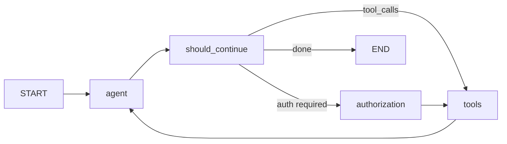
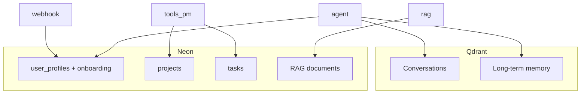
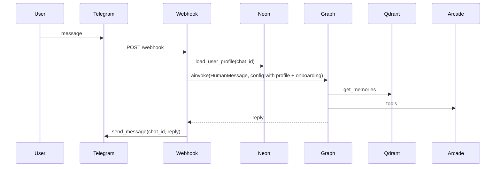

---

# Appendix: Full Project Architecture, Structure, Workflows & Code (Jayla-PA)

> Reference implementation for **jayla-pa**: single-user PA with user profiles and onboarding (Neon), Qdrant for conversations + long-term memory, Neon for project management + RAG, Arcade for Gmail/Calendar, LangGraph agent → authorization → tools → agent. Code below is aligned with the **jayla-pa** codebase.

---

## A. Project structure (jayla-pa)

```
jayla-pa/
├── .env.example
├── pyproject.toml
├── requirements.txt
├── requirements-railway.txt
├── constraints-railway.txt
├── Dockerfile
├── railway.toml
├── langgraph.json
├── configuration.py
├── graph.py
├── nodes.py
├── agent.py
├── tools.py
├── memory.py
├── rag.py
├── prompts.py
├── user_profile.py
├── pa_cli.py
├── speech_to_text.py      # STT (Groq Whisper) for voice messages
├── ONBOARDING_PLAN.md
├── sql/
│   ├── 0-drop-all.sql
│   ├── 0-extensions.sql
│   ├── 1-projects-tasks.sql
│   ├── 2-rag-documents.sql
│   ├── 3-user-profiles.sql
│   ├── 4-onboarding-fields.sql
│   └── 5-reminders.sql    # Optional; reminders = calendar only, not run by migrations
├── telegram_bot/
│   ├── client.py
│   └── webhook.py
├── tools_custom/
│   ├── gmail_attachment.py
│   ├── project_tasks.py
│   └── rag_tools.py       # search_my_documents (RAG)
└── scripts/
    ├── run_sql_migrations.py
    ├── init_qdrant.py
    ├── set_telegram_webhook.py
    ├── set_railway_vars.sh
    ├── curl_deployed.sh
    ├── ensure_cron_secret.sh   # Optional; cron deprecated
    ├── list_tools.py
    ├── test_env_connections.sh
    ├── test_stt.py             # Groq Whisper STT
    ├── test_tool_calls.py
    └── test_webhook_local.py
```

---

## B. Workflow diagrams

### B.1 Main LangGraph flow



**ASCII:** `START → agent → [authorization | tools | END]; tools → agent` (loop).

### B.2 Data stack (Qdrant + Neon)



### B.3 Telegram webhook (jayla-pa)



---

## C. Reference code (by file) — jayla-pa

Adapt package names and env; Arcade = Gmail + Google Calendar; project/task tools use Neon (§8); user profiles and onboarding from Neon (user_profile.py, ONBOARDING_PLAN.md).

### C.1 configuration.py (optional; langchain-academy/module-6 style)

```python
import os
from dataclasses import dataclass, fields
from typing import Optional
from langchain_core.runnables import RunnableConfig

@dataclass(kw_only=True)
class Configuration:
    user_id: str = "default-user"
    thread_id: str = "default"
    user_name: str = ""
    user_role: str = ""
    user_company: str = ""
    jayla_role: str = "You are Jayla, a personal assistant. You help with Gmail, Calendar, and projects/tasks."

    @classmethod
    def from_runnable_config(cls, config: Optional[RunnableConfig] = None) -> "Configuration":
        configurable = config.get("configurable", {}) if config else {}
        values = {
            f.name: os.environ.get(f.name.upper(), configurable.get(f.name))
            for f in fields(cls) if f.init
        }
        return cls(**{k: v for k, v in values.items() if v is not None})
```

### C.2 graph.py (arcade_1_basics + pa_agent; jayla-pa uses lazy _tools_node)

```python
from langgraph.checkpoint.memory import MemorySaver
from langgraph.graph import END, START, MessagesState, StateGraph
from agent import call_agent
from nodes import authorize, should_continue

async def _tools_node(state, config):
    from tools import get_tool_node
    return await get_tool_node().ainvoke(state, config)

def build_graph(checkpointer=None):
    workflow = StateGraph(MessagesState)
    workflow.add_node("agent", call_agent)
    workflow.add_node("tools", _tools_node)
    workflow.add_node("authorization", authorize)
    workflow.add_edge(START, "agent")
    workflow.add_conditional_edges("agent", should_continue, ["authorization", "tools", END])
    workflow.add_edge("authorization", "tools")
    workflow.add_edge("tools", "agent")
    memory = checkpointer or MemorySaver()
    return workflow.compile(checkpointer=memory)
```

### C.3 nodes.py (arcade_1_basics + pa_agent)

```python
import os
from langchain_core.runnables import RunnableConfig
from langgraph.graph import END, MessagesState
from tools import get_manager

def should_continue(state: MessagesState):
    if not state["messages"]:
        return END
    last = state["messages"][-1]
    if not getattr(last, "tool_calls", None):
        return END
    manager = get_manager()
    for tc in last.tool_calls:
        if manager.requires_auth(tc.get("name", "")):
            return "authorization"
    return "tools"

def authorize(state: MessagesState, config: RunnableConfig):
    user_id = config.get("configurable", {}).get("user_id") or os.environ.get("EMAIL", "")
    manager = get_manager()
    for tc in state["messages"][-1].tool_calls:
        name = tc.get("name", "")
        if not manager.requires_auth(name):
            continue
        auth_response = manager.authorize(name, user_id)
        if auth_response.status != "completed":
            print("\n🔐 Authorization required:", auth_response.url)
            manager.wait_for_auth(auth_response.id)
    return {"messages": []}
```

### C.4 agent.py (jayla-pa: user_context, onboarding_context, time_of_day, DeepSeek optional)

**Note:** The live agent also injects **document_context** (RAG: top-k chunks from `rag.retrieve()` per turn) and **full datetime context** (current_date, tomorrow_date, timezone, weekday, current_time_iso, etc.) into the system prompt so Jayla never guesses "today" or "now". See `prompts.JAYLA_SYSTEM_PROMPT` placeholders `{document_context}` and the real-date block.

```python
import re
import os
from datetime import datetime
from zoneinfo import ZoneInfo
from langchain_core.messages import SystemMessage, ToolMessage
from langchain_core.runnables import RunnableConfig
from langgraph.graph import MessagesState
try:
    from langchain_deepseek import ChatDeepSeek
except ImportError:
    ChatDeepSeek = None
from langchain_groq import ChatGroq
from tools import get_tools_for_model
from memory import get_memory_namespace, get_memories
from prompts import JAYLA_SYSTEM_PROMPT, JAYLA_USER_CONTEXT_KNOWN, JAYLA_USER_CONTEXT_UNKNOWN

MAX_CONTENT_CHARS = int(os.environ.get("PA_MAX_CONTENT_CHARS", "3500"))

def _get_time_of_day() -> str:
    tz_name = os.environ.get("TIMEZONE", "UTC")
    try:
        tz = ZoneInfo(tz_name)
    except Exception:
        tz = ZoneInfo("UTC")
    hour = datetime.now(tz).hour
    if 5 <= hour < 12:
        return "morning"
    if 12 <= hour < 17:
        return "afternoon"
    return "evening"

def _truncate(content: str) -> str:
    if not content or len(content) <= MAX_CONTENT_CHARS:
        return content
    text = re.sub(r"<[^>]+>", " ", content)
    text = re.sub(r"\s+", " ", text).strip()
    return text[: MAX_CONTENT_CHARS - 20] + "\n\n...[truncated]"

def _get_model():
    if os.environ.get("DEEPSEEK_API_KEY") and ChatDeepSeek:
        return ChatDeepSeek(
            model=os.environ.get("LLM_MODEL", "deepseek-chat"),
            api_key=os.environ["DEEPSEEK_API_KEY"],
            temperature=0,
        )
    return ChatGroq(
        model=os.environ.get("GROQ_MODEL", "llama-3.1-8b-instant"),
        api_key=os.environ["GROQ_API_KEY"],
        temperature=0,
    )

def call_agent(state: MessagesState, config: RunnableConfig, *, store=None):
    messages = state["messages"]
    memory_context = ""
    if store:
        namespace, _ = get_memory_namespace(config)
        last_user = next((m for m in reversed(messages) if getattr(m, "type", None) == "human"), None)
        if last_user:
            memories = get_memories(store, namespace, str(last_user.content))
            memory_context = "\n".join(f"- {m}" for m in memories) if memories else ""
    conf = config.get("configurable") or {}
    user_name = (conf.get("user_name") or "").strip()
    user_role = (conf.get("user_role") or "").strip()
    user_company = (conf.get("user_company") or "").strip()
    key_dates = (conf.get("key_dates") or "").strip()
    communication_preferences = (conf.get("communication_preferences") or "").strip()
    current_work_context = (conf.get("current_work_context") or "").strip()
    if user_name or user_role or user_company:
        role_part = f", {user_role}" if user_role else ""
        company_part = f" at {user_company}" if user_company else ""
        user_context = JAYLA_USER_CONTEXT_KNOWN.format(
            user_name=user_name or "the user",
            role_part=role_part,
            company_part=company_part,
        )
    else:
        user_context = JAYLA_USER_CONTEXT_UNKNOWN
    parts = []
    if key_dates:
        parts.append(f"Key dates to remember: {key_dates}")
    if communication_preferences:
        parts.append(f"Communication preferences: {communication_preferences}. Follow these when replying (e.g. brief vs detailed, boundaries).")
    if current_work_context:
        parts.append(f"Current work: projects, deadlines, tasks, reminders: {current_work_context}. Use this to prioritise and suggest follow-up.")
    onboarding_context = "\n".join(parts) if parts else ""
    system_content = JAYLA_SYSTEM_PROMPT.format(
        user_context=user_context,
        time_of_day=_get_time_of_day(),
        memory_context=memory_context or "(None)",
        onboarding_context=onboarding_context,
        current_activity="",
    )
    trimmed = [
        m if not (isinstance(m, ToolMessage) and len((m.content or "")) > MAX_CONTENT_CHARS)
        else ToolMessage(content=_truncate(m.content), tool_call_id=m.tool_call_id)
        for m in messages
    ]
    model = _get_model()
    model_with_tools = model.bind_tools(get_tools_for_model())
    msgs = [SystemMessage(content=system_content)] + list(trimmed)
    response = model_with_tools.invoke(msgs)
    return {"messages": [response]}
```

### C.5 tools.py (pa_agent, Gmail + Calendar; no Asana; + project tools)

```python
import os
from langchain_arcade import ToolManager
from langgraph.prebuilt import ToolNode

_manager = None
_tool_node = None

def get_manager():
    global _manager
    if _manager is None:
        _manager = ToolManager(api_key=os.environ["ARCADE_API_KEY"])
        _manager.init_tools(toolkits=["Gmail", "Google Calendar"])
    return _manager

def get_tools():
    from tools_custom.project_tasks import get_project_tools
    from tools_custom.rag_tools import get_rag_tools
    manager = get_manager()
    arcade_tools = manager.to_langchain(use_interrupts=True)
    return arcade_tools + get_project_tools() + get_rag_tools()

def get_tools_for_model():
    return get_tools()

def get_tool_node():
    global _tool_node
    if _tool_node is None:
        _tool_node = ToolNode(get_tools())
    return _tool_node
```

### C.6 memory.py (Qdrant — Ava-style)

*(Same as arcade-ai-agent C.6; use get_memory_namespace, get_memories, put_memory.)*

### C.7 prompts.py (jayla-pa: user_context known/unknown, onboarding_context)

```python
# When we know who the user is (name/role/company), inject this; otherwise use the "unknown" block.
JAYLA_USER_CONTEXT_KNOWN = """The user you assist is {user_name}{role_part}{company_part}. Address them by name when replying. Behave as a professional personal assistant."""

JAYLA_USER_CONTEXT_UNKNOWN = """You do not yet know who you're assisting. The first time they greet you or start a conversation, ask for their name, role, and company so you can address them properly. Once they tell you, refer to them by name like a professional personal assistant."""

JAYLA_SYSTEM_PROMPT = """You are Jayla, a personal assistant.

{user_context}

When the user greets you or starts the conversation (e.g. hi, hello, hey, good morning, or a first message), respond with a time-appropriate greeting based on the current time of day ({time_of_day}): use "Good morning" in the morning, "Good afternoon" in the afternoon, "Good evening" in the evening. Then in one or two short sentences introduce your capabilities: you can help with Gmail (read, send, search, and manage emails), Google Calendar (view and manage events), and projects/tasks (list and create projects, list and create tasks, update task status). Keep the welcome brief and friendly.

You have project/task tools: list_projects (use when asked "what projects do I have?", "list my projects", "show projects"), create_project, list_tasks, create_task_in_project, update_task, get_task. Always use the list_projects tool when the user asks about their projects.

Be concise. Only state what tools return.

User context:
{memory_context}
{onboarding_context}

Current activity: {current_activity}
"""

MEMORY_ANALYSIS_PROMPT = """Extract important personal facts from the message. Output JSON: {"is_important": bool, "formatted_memory": str or null}. Only extract facts, not requests. Examples: "remember I love Star Wars" -> {"is_important": true, "formatted_memory": "Loves Star Wars"}. "How are you?" -> {"is_important": false, "formatted_memory": null}. Message: {message}"""
```

### C.8 telegram_bot/webhook.py (jayla-pa: load profile, pass onboarding in config)

```python
import os
from fastapi import FastAPI, Request, Header
from langchain_core.messages import HumanMessage
from user_profile import load_user_profile, save_user_profile, extract_profile_from_message
from graph import build_graph
from telegram_bot.client import send_message, send_typing

app = FastAPI()
_graph = None

def _get_graph():
    global _graph
    if _graph is None:
        from graph import build_graph as _build
        _graph = _build()
    return _graph

@app.post("/webhook")
async def webhook(request: Request, x_telegram_bot_api_secret_token: str | None = Header(None, alias="X-Telegram-Bot-Api-Secret-Token")):
    if os.environ.get("TELEGRAM_WEBHOOK_SECRET") and x_telegram_bot_api_secret_token != os.environ.get("TELEGRAM_WEBHOOK_SECRET"):
        return {"ok": False}
    body = await request.json()
    message = body.get("message") or body.get("edited_message") or {}
    chat = message.get("chat") or {}
    chat_id = str(chat.get("id") or "")
    text = (message.get("text") or "").strip()
    if not text:
        return {"ok": True}
    if os.environ.get("TELEGRAM_CHAT_ID") and chat_id != os.environ["TELEGRAM_CHAT_ID"]:
        return {"ok": True}
    profile = load_user_profile(chat_id)
    config = {
        "configurable": {
            "thread_id": chat_id,
            "user_id": os.environ.get("EMAIL", ""),
            "user_name": profile.get("name", ""),
            "user_role": profile.get("role", ""),
            "user_company": profile.get("company", ""),
            "key_dates": profile.get("key_dates", ""),
            "communication_preferences": profile.get("communication_preferences", ""),
            "current_work_context": profile.get("current_work_context", ""),
            "onboarding_step": profile.get("onboarding_step", 0),
        }
    }
    graph = _get_graph()
    inputs = {"messages": [HumanMessage(content=text)]}
    await send_typing(chat_id=chat_id)
    result = await graph.ainvoke(inputs, config=config)
    reply = ""
    for m in reversed(result.get("messages", [])):
        if getattr(m, "type", None) == "ai" and getattr(m, "content", None):
            reply = m.content if isinstance(m.content, str) else str(m.content)
            break
    if reply:
        await send_message(reply, chat_id=chat_id)
    if not (profile.get("name") or profile.get("role") or profile.get("company")):
        extracted = extract_profile_from_message(text)
        if extracted and (extracted.get("name") or extracted.get("role") or extracted.get("company")):
            save_user_profile(chat_id, **extracted)
    return {"ok": True}
```

### C.9 telegram_bot/client.py (jayla-pa: chat_id passed)

```python
import os
from telegram import Bot

_bot = None

def get_bot():
    global _bot
    if _bot is None:
        _bot = Bot(token=os.environ["TELEGRAM_BOT_TOKEN"])
    return _bot

async def send_message(text: str, chat_id: str | None = None, parse_mode: str | None = None):
    cid = chat_id or os.environ.get("TELEGRAM_CHAT_ID")
    if not cid:
        raise ValueError("TELEGRAM_CHAT_ID not set and chat_id not provided")
    await get_bot().send_message(chat_id=cid, text=text, parse_mode=parse_mode)

async def send_typing(chat_id: str | None = None):
    cid = chat_id or os.environ.get("TELEGRAM_CHAT_ID")
    if not cid:
        return
    await get_bot().send_chat_action(chat_id=cid, action="typing")
```

### C.10 sql/0-extensions.sql

```sql
CREATE EXTENSION IF NOT EXISTS vector;
CREATE EXTENSION IF NOT EXISTS "uuid-ossp";
CREATE EXTENSION IF NOT EXISTS pg_trgm;
```

### C.11 sql/1-projects-tasks.sql (§8)

*(Same as arcade-ai-agent C.11.)*

### C.12 sql/2-rag-documents.sql (jayla-pa: user_id, scope, expires_at, 768d; retention = keep permanent or auto-offload after 7 days)

```sql
CREATE TABLE IF NOT EXISTS documents (
    id BIGSERIAL PRIMARY KEY,
    user_id TEXT NOT NULL,
    content TEXT NOT NULL,
    metadata JSONB DEFAULT '{}',
    embedding vector(768),
    scope TEXT DEFAULT 'long_term' CHECK (scope IN ('long_term', 'session')),
    expires_at TIMESTAMPTZ,
    created_at TIMESTAMP WITH TIME ZONE DEFAULT CURRENT_TIMESTAMP
);
CREATE INDEX IF NOT EXISTS idx_documents_embedding ON documents USING ivfflat (embedding vector_cosine_ops) WITH (lists = 1);
CREATE INDEX IF NOT EXISTS idx_documents_user_id ON documents(user_id);
CREATE INDEX IF NOT EXISTS idx_documents_expires_at ON documents(expires_at) WHERE expires_at IS NOT NULL;
```

### C.13 sql/3-user-profiles.sql (jayla-pa)

```sql
CREATE TABLE IF NOT EXISTS user_profiles (
  thread_id TEXT PRIMARY KEY,
  name TEXT,
  role TEXT,
  company TEXT,
  updated_at TIMESTAMPTZ DEFAULT NOW()
);
```

### C.14 sql/4-onboarding-fields.sql (jayla-pa; see ONBOARDING_PLAN.md)

```sql
ALTER TABLE user_profiles ADD COLUMN IF NOT EXISTS key_dates TEXT;
ALTER TABLE user_profiles ADD COLUMN IF NOT EXISTS communication_preferences TEXT;
ALTER TABLE user_profiles ADD COLUMN IF NOT EXISTS current_work_context TEXT;
ALTER TABLE user_profiles ADD COLUMN IF NOT EXISTS onboarding_step INT DEFAULT 0;
ALTER TABLE user_profiles ADD COLUMN IF NOT EXISTS onboarding_completed_at TIMESTAMPTZ;
```

### C.15 .env.example (jayla-pa)

```bash
# Arcade
ARCADE_API_KEY=
EMAIL=

# LLM: Groq or DeepSeek (§1.2)
GROQ_API_KEY=
GROQ_MODEL=llama-3.1-8b-instant
# DEEPSEEK_API_KEY=
# LLM_MODEL=deepseek-chat

# Qdrant (conversations + long-term memory)
QDRANT_URL=
QDRANT_API_KEY=

# Neon (user profiles, project management + RAG)
DATABASE_URL=

# Telegram
TELEGRAM_BOT_TOKEN=
TELEGRAM_CHAT_ID=
TELEGRAM_WEBHOOK_SECRET=
BASE_URL=   # Public URL for webhook (no trailing slash)

# Optional: timezone for greetings and calendar/reminder times; CLI user context
TIMEZONE=UTC
# USER_NAME=
# USER_ROLE=
# USER_COMPANY=
```

### C.16 requirements.txt (jayla-pa)

```
langgraph
langchain-core
langchain-groq
langchain-deepseek
langchain-arcade==1.3.1
langchain-community
qdrant-client
sentence-transformers
python-dotenv
fastapi
uvicorn
python-telegram-bot
docling
langchain-text-splitters
psycopg2-binary
PyPDF2
docx2txt
```

*(For Railway/slim deploy use requirements-railway.txt + constraints-railway.txt; see Dockerfile. RAG fallbacks: PyPDF2, docx2txt when Docling fails.)*

### C.17 langgraph.json

```json
{"graphs": {"jayla": "./graph.py:graph"}, "dependencies": ["."]}
```

---

## D. Gems implementation (full code)

Full code for the gems from **7.7-SupervisorAgent** (PERSONAL_ASSISTANT_PATTERNS.md §10). Copy into the codebase when implementing.

### D.1 Brave web search tool

**New file: `tools_custom/brave_tools.py`**

```python
# Brave Search tool for "current" / "latest" / "news" queries. See PERSONAL_ASSISTANT_PATTERNS.md §10.

import os
import time
import logging
from typing import Any

from langchain_core.tools import tool

logger = logging.getLogger(__name__)


def _search_brave_sync(api_key: str, query: str, count: int = 5) -> list[dict[str, Any]]:
    """Call Brave Search API (sync). Returns list of {title, url, description, score}."""
    if not api_key or not query or not query.strip():
        return []
    count = min(max(count, 1), 10)
    try:
        import httpx
    except ImportError:
        logger.warning("httpx not installed; pip install httpx for Brave search")
        return []
    headers = {"X-Subscription-Token": api_key, "Accept": "application/json"}
    params = {"q": query.strip(), "count": count}
    time.sleep(0.5)  # Light rate limiting
    try:
        with httpx.Client(timeout=30.0) as client:
            r = client.get(
                "https://api.search.brave.com/res/v1/web/search",
                headers=headers,
                params=params,
            )
            if r.status_code != 200:
                logger.warning(f"Brave API {r.status_code}: {r.text[:200]}")
                return []
            data = r.json()
            web = data.get("web", {}).get("results", [])
            out = []
            for i, item in enumerate(web):
                score = max(0.1, 1.0 - (i * 0.05))
                out.append({
                    "title": item.get("title", ""),
                    "url": item.get("url", ""),
                    "description": item.get("description", ""),
                    "score": score,
                })
            return out
    except Exception as e:
        logger.warning(f"Brave search failed: {e}")
        return []


@tool
def search_web(query: str, max_results: int = 5) -> str:
    """Search the web for current information (news, trends, latest). Call this when the user asks for "latest", "current", "news", "what's happening", or real-time info. Use search_my_documents for the user's uploaded docs."""
    api_key = os.environ.get("BRAVE_API_KEY", "").strip()
    if not api_key:
        return "Web search is not configured (BRAVE_API_KEY missing). I can only search your uploaded documents."
    try:
        results = _search_brave_sync(api_key, query, max_results)
    except Exception as e:
        return f"Web search failed: {e}"
    if not results:
        return "No web results found for that query."
    lines = ["Web search results:\n"]
    for r in results[:max_results]:
        lines.append(f"- **{r.get('title', '')}**\n  {r.get('url', '')}\n  {r.get('description', '')}")
    return "\n".join(lines)


def get_brave_tools():
    """Return list of Brave tools (empty if BRAVE_API_KEY not set)."""
    if os.environ.get("BRAVE_API_KEY", "").strip():
        return [search_web]
    return []
```

**Change in `tools.py`:** add Brave tools to `get_tools()`:

```python
def get_tools():
    from tools_custom.project_tasks import get_project_tools
    from tools_custom.rag_tools import get_rag_tools
    from tools_custom.brave_tools import get_brave_tools
    manager = get_manager()
    arcade_tools = manager.to_langchain(use_interrupts=True)
    return arcade_tools + get_project_tools() + get_rag_tools() + get_brave_tools()
```

**Prompt addition (in `prompts.py` JAYLA_SYSTEM_PROMPT, under Tools):**

```
- **Web search:** When the user asks for "latest", "current", "news", "what's happening with X", or real-time information, call search_web(query). Use search_my_documents for their uploaded documents only.
```

**`.env.example`:** add `BRAVE_API_KEY=` (optional). **requirements.txt:** add `httpx` for Brave API calls.

---

### D.2 Prompt: concise tool results

**Add to `JAYLA_SYSTEM_PROMPT` in prompts.py (e.g. after "Be concise."):**

```
When reporting tool results to the user, use 2–4 bullet points; avoid pasting raw JSON or long lists. Summarize what was done or what was found.
```

---

### D.3 Max steps in graph

**Option A: use config only (no state change).** In `nodes.py`, `should_continue` receives `(state, config)`. Increment a step counter in config from outside (e.g. webhook) each time you invoke the graph and stop after N invocations — or use a single invoke and count steps inside the graph by extending state (Option B).

**Option B: extend state with step_count.** Custom state and conditional END when step_count >= MAX_STEPS.

**New state (e.g. in `graph.py` or a small `state.py`):**

```python
from typing import Annotated, TypedDict
from langgraph.graph.message import add_messages

class JaylaState(TypedDict, total=False):
    messages: Annotated[list, add_messages]
    step_count: int

MAX_GRAPH_STEPS = 20
```

**In `graph.py`:**

```python
from state import JaylaState, MAX_GRAPH_STEPS  # or define JaylaState/MAX_GRAPH_STEPS in graph.py

def build_graph(checkpointer=None):
    workflow = StateGraph(JaylaState)
    workflow.add_node("agent", call_agent)
    workflow.add_node("tools", _tools_node)
    workflow.add_node("authorization", authorize)
    workflow.add_edge(START, "agent")
    workflow.add_conditional_edges("agent", should_continue, ["authorization", "tools", END])
    workflow.add_edge("authorization", "tools")
    workflow.add_edge("tools", "agent")
    memory = checkpointer or MemorySaver()
    return workflow.compile(checkpointer=memory)
```

**In `nodes.py`, `should_continue`:** accept `(state, config)`; if `state.get("step_count", 0) >= MAX_GRAPH_STEPS`, return `END`. Otherwise keep existing logic (authorization / tools / END).

**In `agent.py` and tools node:** return `{"messages": [...], "step_count": state.get("step_count", 0) + 1}` so step_count increments each agent→tools→agent cycle.

**Initial state from webhook/CLI:** `inputs = {"messages": [HumanMessage(content=text)], "step_count": 0}`. If you keep using `MessagesState` only, you cannot add step_count to state without changing the state type; then use Option A (external counter) or add a wrapper that counts steps per single `ainvoke` by inspecting the number of tool rounds in the result.

**Minimal Option A (no state change):** In `nodes.should_continue`, read `config.get("configurable", {}).get("step_count", 0)`. The webhook would need to pass `step_count` and somehow increment it — but config is read-only per invoke. So the clean approach is Option B: define `JaylaState` with `messages` and `step_count`, and have both agent and tools nodes return `step_count: state.get("step_count", 0) + 1`. Then in `should_continue(state, config)`: if `state.get("step_count", 0) >= MAX_GRAPH_STEPS`, return `END`.

**Full `nodes.py` change for Option B:**

```python
# At top: from graph.state import MAX_GRAPH_STEPS  # or define MAX_GRAPH_STEPS = 20 in nodes.py

def should_continue(state, config=None):
    if state.get("step_count", 0) >= MAX_GRAPH_STEPS:
        return END
    if not state["messages"]:
        return END
    last = state["messages"][-1]
    # ... rest unchanged: tool_calls → authorization or tools, else END
```

**Full `graph.py` (with JaylaState):**

```python
from typing import Annotated, TypedDict
from langgraph.graph.message import add_messages
from langgraph.checkpoint.memory import MemorySaver
from langgraph.graph import END, START, StateGraph
from agent import call_agent
from nodes import authorize, should_continue

class JaylaState(TypedDict, total=False):
    messages: Annotated[list, add_messages]
    step_count: int

MAX_GRAPH_STEPS = 20

async def _tools_node(state, config):
    from tools import get_tool_node
    result = await get_tool_node().ainvoke(state, config)
    result["step_count"] = state.get("step_count", 0) + 1
    return result

def build_graph(checkpointer=None):
    workflow = StateGraph(JaylaState)
    workflow.add_node("agent", call_agent)
    workflow.add_node("tools", _tools_node)
    workflow.add_node("authorization", authorize)
    workflow.add_edge(START, "agent")
    workflow.add_conditional_edges("agent", should_continue, ["authorization", "tools", END])
    workflow.add_edge("authorization", "tools")
    workflow.add_edge("tools", "agent")
    memory = checkpointer or MemorySaver()
    return workflow.compile(checkpointer=memory)
```

**`call_agent` must return `step_count` too:** e.g. `return {"messages": [response], "step_count": state.get("step_count", 0) + 1}`. Webhook/CLI initial state: `{"messages": [HumanMessage(content=text)], "step_count": 0}`.

---

### D.4 Research-aware email draft

**Prompt addition (in prompts.py, under Tools / Emails):**

```
When drafting an email and you have document context (RAG) or previous context, use it: summarize 2–3 key points as bullet points in the email body instead of writing from scratch. If the user said "draft an email to X about Y", first use document context or search_my_documents if relevant, then compose the draft with those points.
```

**Optional tool: suggest body from context (in `tools_custom/rag_tools.py`):**

```python
import os
from langchain_core.tools import tool
from rag import retrieve as rag_retrieve

@tool
def suggest_email_body_from_context(purpose: str, recipient: str = "") -> str:
    """Suggest an email body from the user's document context (RAG). Call when the user wants to draft an email and you have or can retrieve relevant context. Returns suggested bullet points; use them in Gmail draft tools."""
    user_id = os.environ.get("USER_ID") or os.environ.get("EMAIL", "default-user")
    chunks = rag_retrieve(purpose, user_id=user_id, limit=3)
    if not chunks:
        return "No relevant document context. Compose the email from scratch."
    return "Suggested points from your documents:\n\n" + "\n\n".join(f"• {c}" for c in chunks)
```

Register `suggest_email_body_from_context` in `get_rag_tools()` (return it alongside `search_my_documents`) and mention it in the prompt.

---

### D.5 Fallback hint

**Add one line to `JAYLA_SYSTEM_PROMPT` (e.g. near the end of general instructions):**

```
If the user is just chatting or the request is unclear, answer briefly and optionally suggest: "I can also search your docs, check your calendar, or draft an email if you'd like."
```

---

### D.6 Optional deps module

**New file: `deps.py` (at jayla-pa root)**

```python
# Optional dependency injection for tools. See PERSONAL_ASSISTANT_PATTERNS.md §10.

import os
from dataclasses import dataclass
from typing import Optional


@dataclass
class JaylaDeps:
    """Env-derived deps passed via config for testability."""
    user_id: str
    brave_api_key: Optional[str] = None
    database_url: Optional[str] = None

    @classmethod
    def from_env(cls, user_id: Optional[str] = None) -> "JaylaDeps":
        return cls(
            user_id=(user_id or os.environ.get("EMAIL") or os.environ.get("USER_ID") or "default"),
            brave_api_key=os.environ.get("BRAVE_API_KEY", "").strip() or None,
            database_url=os.environ.get("DATABASE_URL"),
        )
```

Webhook/CLI can build `config["configurable"]["deps"] = JaylaDeps.from_env(user_id=...)` and tools that need Brave or DB can read from config instead of `os.environ` directly (so tests can inject mocks).

---

### D.7 Pytest examples

**New directory: `tests/` with `conftest.py` and test modules.**

**`tests/conftest.py`:**

```python
import os
import pytest

@pytest.fixture(autouse=True)
def env_jayla(monkeypatch):
    monkeypatch.setenv("DATABASE_URL", os.environ.get("DATABASE_URL", "postgresql://localhost/test"))
    monkeypatch.setenv("EMAIL", "test@example.com")
```

**`tests/test_rag.py`:**

```python
import pytest
from rag import retrieve, update_documents_retention

def test_retrieve_empty_query():
    assert retrieve("", user_id="test") == []

def test_retrieve_no_db(monkeypatch):
    monkeypatch.setenv("DATABASE_URL", "")
    with pytest.raises(Exception):
        retrieve("hello", user_id="test")
```

**`tests/test_agent.py` (minimal; mock tools):**

```python
import pytest
from unittest.mock import patch, MagicMock
from langchain_core.messages import HumanMessage
from agent import call_agent

@pytest.fixture
def minimal_config():
    return {
        "configurable": {
            "thread_id": "test",
            "user_id": "test@example.com",
            "user_name": "",
            "user_role": "",
            "user_company": "",
            "key_dates": "",
            "communication_preferences": "",
            "current_work_context": "",
        }
    }

def test_call_agent_returns_messages(minimal_config):
    with patch("agent.get_tools_for_model", return_value=[]):
        state = {"messages": [HumanMessage(content="Hi")]}
        out = call_agent(state, minimal_config)
        assert "messages" in out
        assert len(out["messages"]) == 1
```

**`tests/test_graph.py`:**

```python
import pytest
from langchain_core.messages import HumanMessage
from graph import build_graph

@pytest.mark.asyncio
async def test_graph_invoke():
    graph = build_graph()
    config = {"configurable": {"thread_id": "test", "user_id": "test@example.com"}}
    inputs = {"messages": [HumanMessage(content="Hello")]}
    result = await graph.ainvoke(inputs, config=config)
    assert "messages" in result
```

**`requirements.txt`:** add `pytest`, `pytest-asyncio` for async tests. Run: `pytest tests/ -v`.

---

*End of appendix. This document is the jayla-pa implementation reference; see also ONBOARDING_PLAN.md and PERSONAL_ASSISTANT_PATTERNS.md.*
